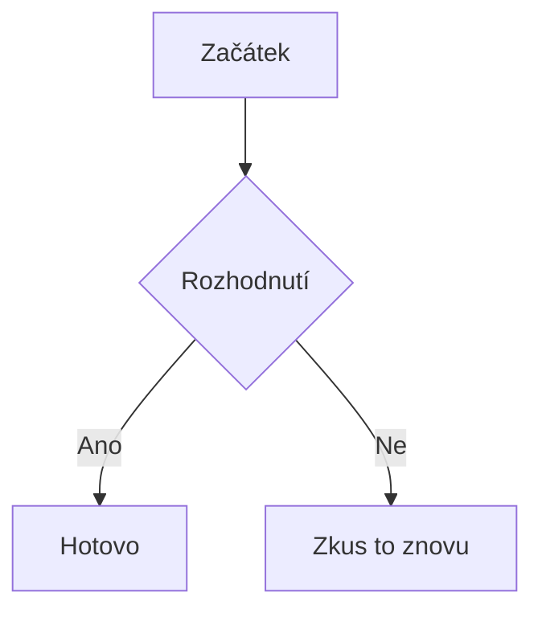

# Markdown
Odkaz pomocí tohoto bez mezery: [jmeno] (odkaz)
[youtube](https://www.youtube.com/)
obrázek uděláme stejně jen s přidáním __!__ na začátek a za __|__ šířku obrázku


Tohle je citace: (s > na začátku řádku)
> "Jednání dětí je manifestací lásky nebo zoufalého volání po lásce. Láska je __vždy__ nejlepší odpověď"

tabulka je trochu složitější __|__ jsou sloupce a __-__ oddělení hlavičky. __:__ určuje zarovnání.

| __čísla__ | __jsou prvočísla__ |
| --------- | ------------------ |
| 1         | Ne                 |
| 12        | Ne                 |
| 7         | Ano                |

### Obsidian specifika
Odkazy jsou rychlejší.
[[Todo]]
[[Todo#Před rv v Plzni (do 12.3.)]]
[[Todo#^5a99eb]]
[[Todo|Jiné zobrazení]]

[[Todo#^5a99eb|o úkolech v Todo]]

> [!tip] Nadpis (volitelný)
> Obsah boxu výčet možností za __!__ warning, tip, error, quote, todo

>[!warning]

>[!tip]

>[!error]

>[!quote]

>[!todo]

Vkládání obsahu:
![[Adultismus#Obsah]]


Metada se vkládají takto:

```markdown
---
tagy: [projekt, aktivní]
datum: 2026-03-10
priorita: nízká
---
```

Mermaid (diagramy a grafy):
Grafy lze vykreslit přímo z textového kódu, pokud pojmenujeme textový blok jako `mermaid`



Když chceme vkládat rovnice, používáme __$__ pro řádek
$E=mc^2$ je Einsteinova rovnice. Využívá se syntaxe LaTeX

pro složitější rovnice na nových řádcích:
$$
\int_{a}^{b} f(x) dx
$$
Tabulka nejčastějších příkazů v LaTeXu:

|        Typ        |                  LaTeX kód                  |                 Výsledek                  |
| :---------------: | :-----------------------------------------: | :---------------------------------------: |
|    Horní index    |                    `x^2`                    |                   $x^2$                   |
|    Dolní index    |                    `x_i`                    |                   $x_i$                   |
|      Zlomky       |                `\frac{a}{b}`                |               $\frac{a}{b}$               |
|     Odmocniny     |                `\sqrt[3]{x}`                |               $\sqrt[3]{x}$               |
|   Řecká písmena   |            `\alpha, \beta, \pi`             |           $\alpha, \beta, \pi$            |
|  Sumy/integrály   |           `\sum_{i=1}^{n}, \int`            |          $\sum_{i=1}^{n}, \int$           |
|    Nerovnosti     |               `\le, \ge, \ne`               |              $\le, \ge, \ne$              |
|  Speciální znaky  |                `\pm, \cdot`                 |               $\pm, \cdot$                |
|      Vektor       |                  `\vec{v}`                  |                 $\vec{v}$                 |
|      Symboly      | `$\infty, \forall, \exists, \approx, \neq$` | $\infty, \forall, \exists, \approx, \neq$ |
| Logické operátory |       `$\implies, \iff, \land, \lor$`       |       $\implies, \iff, \land, \lor$       |
Příklad formátovaných rovnic:
- Einsteinova rovnice
$$\color{red}{E} = \color{blue}{mc^2} $$
- Rychlost
$$v = \frac{s}{t} \text{ [m/s]}$$

Příklad složitější rovnice:
- Kvadratická rovnice
$$x=\frac{-b \pm \sqrt{b^2 - 4ac}}{2a}$$
- Kombinace
$$\frac{n!}{k!(n-k)!} = \binom{n}{k}$$

Pro psaní poznámek pod čarou se používá tato syntaxe: zdroj[^1].
A na konci dokumentu:
[^1]: tady je ten zdroj/info.


CPM test (počet úhozů)
177 CPM
214 CPM
239 CPM

