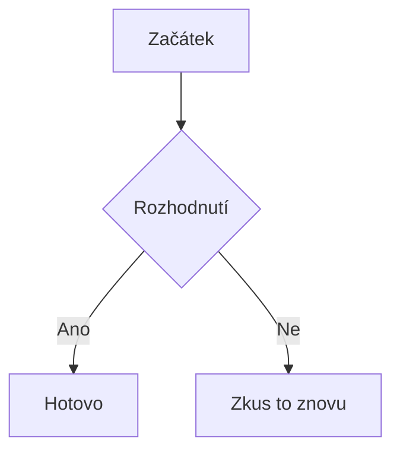

# Markdown
Odkaz pomocí tohoto bez mezery: [jmeno] (odkaz)

[youtube](https://www.youtube.com/)

obrázek uděláme stejně jen s přidáním __!__ na začátek a za __|__ šířku obrázku (to nefunguje)


![[snake.jpg]]


# 1

Tohle je citace: (s > na začátku řádku)
> "Jednání dětí je manifestací lásky nebo zoufalého volání po lásce. Láska je __vždy__ nejlepší odpověď"


![[https://instagram.fprg1-1.fna.fbcdn.net/v/t51.82787-15/719032322_18459252589117514_2897492809364149692_n.jpg?stp=dst-jpg_e35_tt6&_nc_cat=100&ig_cache_key=MzkxMzM4MjMwMjQ3MTA5OTg3NA%3D%3D.3-ccb7-5&ccb=7-5&_nc_sid=58cdad&efg=eyJ2ZW5jb2RlX3RhZyI6IkNBUk9VU0VMX0lURU0ueHBpZHMuMTA4MC5zZHIucmVndWxhcl9waG90by5DMyJ9&_nc_ohc=d0nIrwygu_IQ7kNvwG4hInW&_nc_oc=AdrdPS0rAdNaL7HRcejuvPWbSBy1GSU4AjjyZJCKkNJ-ts-IMfI3C4VbE9cqXJ0of-TsAa21KaXHUsDCT9LtrEei&_nc_ad=z-m&_nc_cid=0&_nc_zt=23&_nc_ht=instagram.fprg1-1.fna&_nc_gid=kG-dkAz2CgqAxigQG4Spwg&_nc_ss=7a22e&oh=00_Af86HsNtk6yclBjZbXXSCX40BNHix7GqlWEXWX5dv52alw&oe=6A29A631|popisek]]

Zde je vidět, že gify s hudbou nefungují:

![[https://video.xx.fbcdn.net/o1/v/t2/f2/m86/AQPyS-Na-B6pvuorh3os9HF0B5qlTmaZQngZnQmIsJQD45kpVYMaFHT1xRM7MMB9J8WodHoBRMmRm-GKmnwBiHuEhDN4wdbgWqFTcaw.mp4?_nc_cat=109&_nc_oc=AdrraNEkmeJVQS5LBGQ-S5oaDU8y_u18klf5wXTGB4ptcP9HtLUaWVWdVo_pQPtXdT8IcSxIidyWLWyvXtgNWO-x&_nc_sid=5e9851&_nc_ht=instagram.fprg1-1.fna.fbcdn.net&_nc_ohc=MmVtIKWxJ14Q7kNvwFWQxSP&efg=eyJ2ZW5jb2RlX3RhZyI6Inhwdl9wcm9ncmVzc2l2ZS5JTlNUQUdSQU0uQ0xJUFMuQzMuNzIwLmRhc2hfYmFzZWxpbmVfMV92MSIsInhwdl9hc3NldF9pZCI6MTMxNTY5MjY4NzQxNzg3NiwiYXNzZXRfYWdlX2RheXMiOjIsInZpX3VzZWNhc2VfaWQiOjEwMDk5LCJkdXJhdGlvbl9zIjozNCwidXJsZ2VuX3NvdXJjZSI6Ind3dyJ9&ccb=17-1&vs=a601f65a4e3f9a0a&_nc_vs=HBksFQIYUmlnX3hwdl9yZWVsc19wZXJtYW5lbnRfc3JfcHJvZC9DOTQzMzBERTAyNzcxOTRFRUNDOTIxMDcxNTg1OTFCRF92aWRlb19kYXNoaW5pdC5tcDQVAALIARIAFQIYUWlnX3hwdl9wbGFjZW1lbnRfcGVybWFuZW50X3YyL0IxNDkyQjAyODQ3ODI5MTkyNkIzOEU2NzAwODJEOUIwX2F1ZGlvX2Rhc2hpbml0Lm1wNBUCAsgBEgAoABgAGwKIB3VzZV9vaWwBMRJwcm9ncmVzc2l2ZV9yZWNpcGUBMRUAACaoiKO0sqfWBBUCKAJDMywXQEFR64UeuFIYEmRhc2hfYmFzZWxpbmVfMV92MREAdf4HZeadAQA&_nc_gid=sxGiZnpqiNMkUtPD-yS5qQ&_nc_zt=28&_nc_ss=7a22e&oh=00_Af9sxtDksrGnnq0xabUwuHnsNt4W3b2sUCw8EGw37w_kgA&oe=6A27B5F2]]

tabulka je trochu složitější __|__ jsou sloupce a __-__ oddělení hlavičky. __:__ určuje zarovnání.

| __čísla__ | __jsou prvočísla__ |
| :---------: | :------------------: |
| 1         | Ne                 |
| 12        | Ne                 |
| 7         | Ano                |

### Obsidian specifika
Odkazy jsou rychlejší.
[[Simpson's paradox]]

[[Simpson's paradox#Historie]]

[[Simpson's paradox#^c432d2|na Matematický popis]]

[[Simpson's paradox#^001|na Historický příklad]]

---

==tento text==

> [!tip] Nadpis (volitelný)
> Obsah boxu výčet možností za __!__ warning, tip, error, quote, todo

>[!warning]

>[!tip]

>[!error]

>[!quote]

>[!todo]

Vkládání obsahu:
![[Simpson's paradox#Praktické důsledky]]


Metada se vkládají takto:

```markdown
---
tagy: [projekt, aktivní]
datum: 2026-03-10
priorita: nízká
---
```

Mermaid (diagramy a grafy):
Grafy lze vykreslit přímo z textového kódu, pokud pojmenujeme textový blok jako `mermaid`



Když chceme vkládat rovnice, používáme __$__ pro řádek
$E=mc^2$ je Einsteinova rovnice. Využívá se syntaxe LaTeX

pro složitější rovnice na nových řádcích:
$$
\int_{a}^{b} f(x) dx
$$
Tabulka nejčastějších příkazů v LaTeXu:

|        Typ        |                  LaTeX kód                  |                 Výsledek                  |
| :---------------: | :-----------------------------------------: | :---------------------------------------: |
|    Horní index    |                    `x^2`                    |                   $x^2$                   |
|    Dolní index    |                    `x_i`                    |                   $x_i$                   |
|      Zlomky       |                `\frac{a}{b}`                |               $\frac{a}{b}$               |
|     Odmocniny     |                `\sqrt[3]{x}`                |               $\sqrt[3]{x}$               |
|   Řecká písmena   |            `\alpha, \beta, \pi`             |           $\alpha, \beta, \pi$            |
|  Sumy/integrály   |           `\sum_{i=1}^{n}, \int`            |          $\sum_{i=1}^{n}, \int$           |
|    Nerovnosti     |               `\le, \ge, \ne`               |              $\le, \ge, \ne$              |
|  Speciální znaky  |                `\pm, \cdot`                 |               $\pm, \cdot$                |
|      Vektor       |                  `\vec{v}`                  |                 $\vec{v}$                 |
|      Symboly      | `\infty, \forall, \exists, \approx, \neq` | $\infty, \forall, \exists, \approx, \neq$ |
| Logické operátory |       `\implies, \iff, \land, \lor`       |       $\implies, \iff, \land, \lor$       |

Příklad formátovaných rovnic:
- Einsteinova rovnice
$$\color{red}{E} = \color{blue}{mc^2} $$
- Rychlost
$$v = \frac{s}{t} \text{ [m/s]}$$

Příklad složitější rovnice:
- Kvadratická rovnice
$$x=\frac{-b \pm \sqrt{b^2 - 4ac}}{2a}$$
- Kombinace
$$\frac{n!}{k!(n-k)!} = \binom{n}{k}$$

Pro psaní poznámek pod čarou se používá tato syntaxe: zdroj[^1].
A na konci dokumentu:
[^1]: tady je ten zdroj/info.

Přidávám ukázku kódu:

```c
int main(){
	printf("Hello world");

	return(0);
}
```

---
---
---
neco
---
---
[[#1]]

[[#1|klikni zde]]

[[Simpson's paradox#Zdroje]]

[[neexistující článek]]
